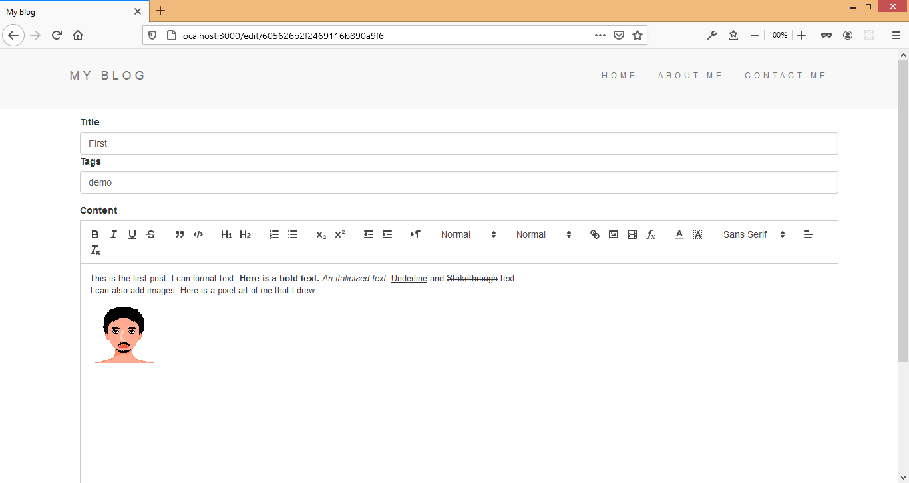
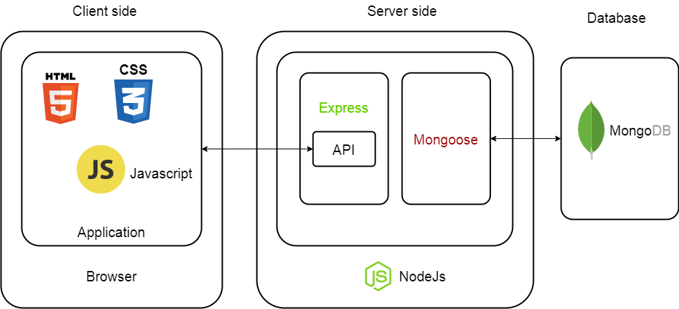

# Blog website App

A Blog App to create posts. Posts are composed using rich text editor (quill.js). User can format text and add images to posts.

Used Node.js and mongodb.

---

## Getting Started

- Download and install Node.js and mongodb.
- Clone this repository.
- Open terminal from project folder.
- Run npm install.
- Run mongod on a terminal.
- Run node app.js on another terminal.
- Go to localhost:3000 on browser.

---

## Architecture and process flow diagram

